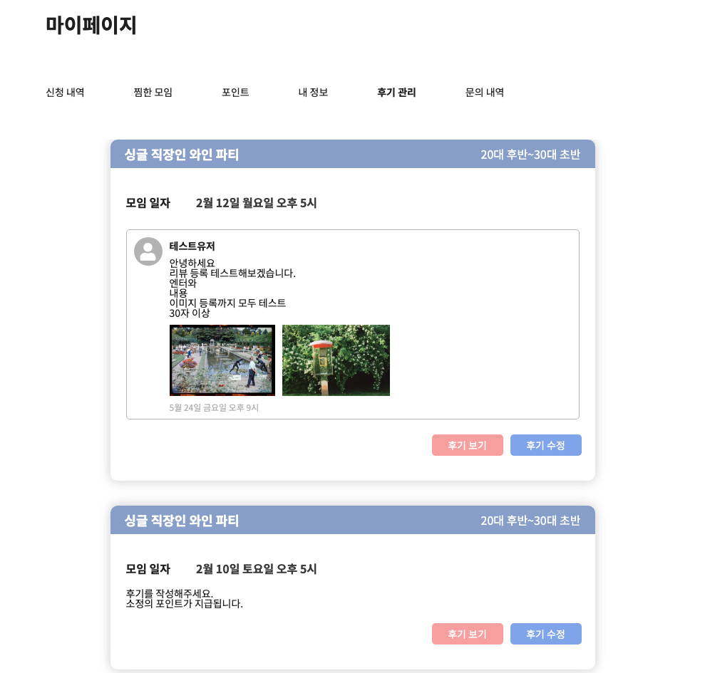
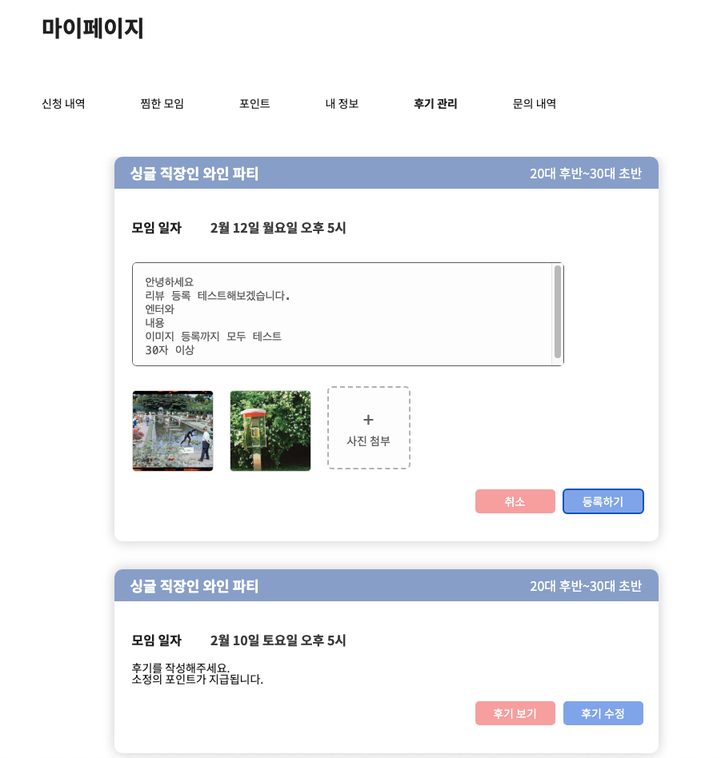
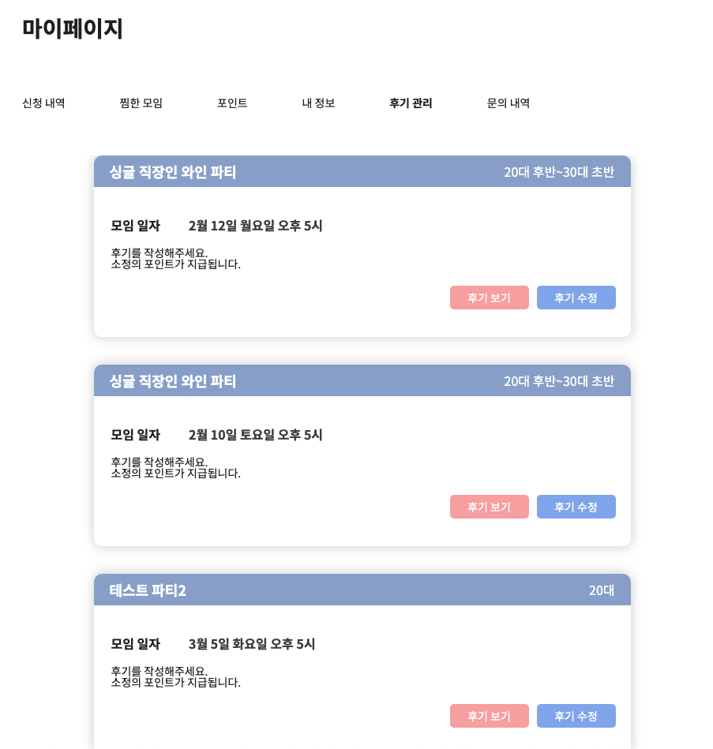
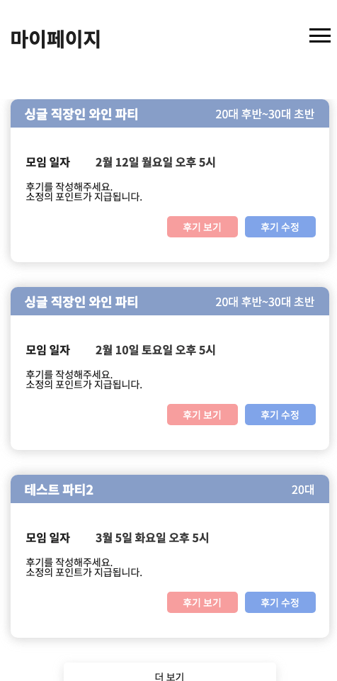
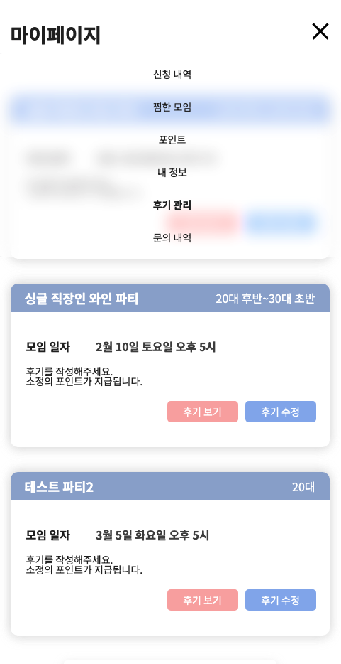

# ✨ WABLE 프론트 구현 과제 🎉

   
 
  <h2> 모임 플랫폼 마이페이지 > 후기 관리 </h2>
    
  

## [Web <<](https://moim-mypage.vercel.app/)

## Preview

### 후기 작성 기능

 

### 반응형

 

## CHALLENGE

- 반응형
- 후기 작성 기능
  - 후기 내용(필수)
  - 이미지 파일 0 ~ 3개 (옵션)
  - 콘솔 찍기 (형식 : 후기 데이터 - 내용 : {} 파일 개수 : {} 파일 원본 이름 : {})

 

## Built With

- [`React`](https://reactjs.org/)
- [`TypeScript`](https://www.typescriptlang.org/)
- [`styled-components`](https://styled-components.com/)
- [`react-query`](https://tanstack.com/)
- [`firebase`](https://firebase.google.com/)
- [`vercel`](https://vercel.com/)

 

## TODO

- 리뷰 삭제 기능
- 리뷰 이미지 수정 기능
- 파티(모임) 전체조회 무한 스크롤 에러
- 테스트코드 작성
- 리팩토링 (복잡한 Hook, 분리하지 못한 컴포넌트 등)

 

## License

- [`MIT License`]('./LICENSE')
